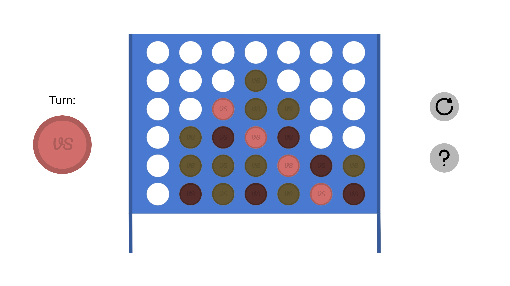

# Connect Four
A two-player version of Connect Four! To play, simply visit the webpage [here](https://vivaansinghvi07.github.io/connect-four/). This game is meant to be played on a horizontal display.

## Credits
- Animation would not be possible if not for the [animejs](https://animejs.com/) library.
- Assets (such as the pieces and the board) were made in Google Drawings.

## Features
- Smooth animations for every aspect of the game (placing pieces, resetting the board, and even highlighting a winning combination)
- Automatic, fast win detection
- A piece which indicates whose turn it is (flips each time a  move is played)
- Mouse and KBM support for placing pieces, resetting game, and escaping help page
- Entirely self-drawn elements for an attempted clean look
- Full resizeability - no matter what your webpage's size is, you should see the same thing, adjusted to your viewport's size (this does have a downside; for vertical devices, the game will look extremely small)

## Playing the Game
You can click on the "help" section of the webpage for more information, but essentially, you play as you do normal connect four.

Here is an example of what the game looks like:

